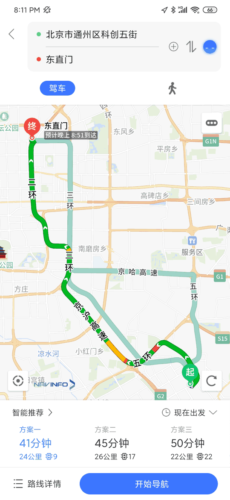
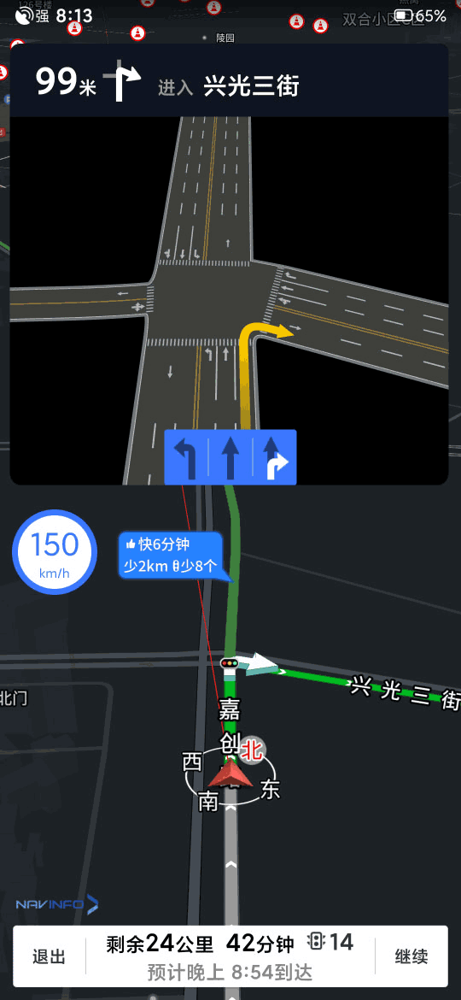

# 关于导航零号

导航零号目前还是半保密的项目，不适合过多的介绍。

导航零号基于自研的SDK开发。具有完整的算路、搜索、路况、引导等全部导航功能。

我们期望将来能做成全开源的项目，服务于所有需要导航技术的公司企业。开源计划还在酝酿中。

# 下载

* [苹果AppStore](https://apps.apple.com/cn/app/%E5%AF%BC%E8%88%AA%E9%9B%B6%E5%8F%B7/id1469022033)
* [华为应用市场](https://appstore.huawei.com/app/C101191423)
* [小米应用商店](http://app.mi.com/details?id=com.mapbar.navigation.zero.release)
* [安卓内测版(密码 mapbar)](https://www.pgyer.com/eGby)
* [iOS内测版(密码 mapbar)](https://www.pgyer.com/xJXq)

# 关于本仓库

本仓库的作用：

1. 存放导航零号的文档。
2. 开放issue tracker，接受来自大众的需求和反馈。督促我们不断改进。

