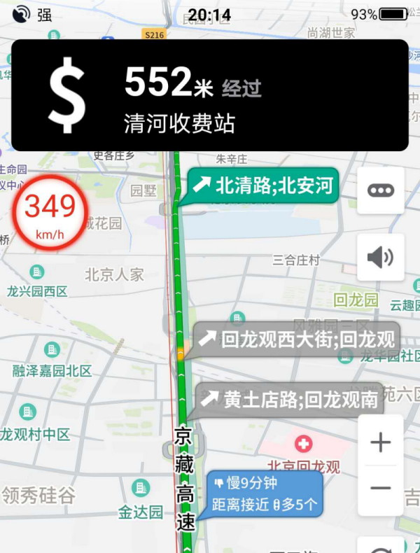

## 2020-07-18

* 主界面改版，操作更方便
  * 搜索框移动到屏幕底部 [#1](/../../issues/1)
  * 支持上拉，把主要功能放在上拉面板中
* 新增转弯后的车道提示，如"左转"，左转后进入xx车道
* 新增高速路上显示出口，连接线，收费站和服务区气泡

* 新增用户信息（历史关键字、历史POI、历史目的地、车辆信息）在线同步
* 搜索结果显示地铁线路、公交线路信息

* 导航中横屏模式下显示当前行政区
* 新增扩大区域搜索

## 2020-07-3
* 新增收藏夹同步功能
* 首页新增上报入口
* 修改bug
  * 修改在算路页面不重新算路的问题
  * 修改算路页面偶发崩溃问题

## 2020-06-19
* 路线支持分享
* 地图支持球面显示
* 优化地图上红绿灯显示位置

## 2020-06-12
* 路口放大图优化
  * 增加到了禁行标志
  * 优化视口大小
  * 优化道路宽度
  * 支持港澳右舵行驶道路

* 修改bug
  * 修改地图点击POI崩溃问题

## 2020-06-5
* 算路结果页面路线终点显示预计到达时间
* 修改bug
  * 修改算路结果页面路线显示问题
  * 修改算路页面地图选点显示路线问题
  * 修改启动后用户头像不显示问题

## 2020-05-22
* 优化搜索结果显示
* 导航设置新增显示看版图和模式图开关
* 修改bug
  * 修改我的位置按钮点击问题
  * 修改数据商店崩溃问题

## 2020-05-9
* 新增账号密码登录
* 新增修改头像、昵称等用户信息功能
* 修改bug
  * 修改断网请求崩溃问题
  * 修改行政区显示问题

## 2020-04-24
* 新增深色模式
* 新增锁车后显示位置信息
* POI报错新增地点名称支持搜索
* 放大图添加车信、增强绿地、改进道路平滑
* 路线转向箭头更平滑
* 修改bug
  * 修改算路输入框跳转显示不全问题

## 2020-04-10
* 新增手机号码登录
* 新增自动巡航功能
* 漫游模式显示车道
* 放大图改进鸟瞰视角
* 美化地图路口转向箭头
* 修改bug
  * 修改路线详情按钮点击问题

## 2020-03-27
* 新增道路报错
* 增强路口放大图
  * 对向道路合并
  * 新增路牙子和绿地装饰
  * 视口优化（如右转专用道）
* 美化地图字体：增强描边，加粗
* 使用扁平化UI风格
* 修改bug
  * 修改蓝牙播报问题
  * 修改登录点击区域问题
  * 修改微信多次登录不上问题

## 2020-03-13
* 新增问题反馈（新增POI、新增道路、POI报错）
* 新增微信扫码登录功能
* 放大图支持白天黑夜模式
* 非导航地图支持白天/黑夜切换
* 支持输入如“天津市限行”，查看限行政策
* 新增2D车头朝上模式
* 面状区域(学校、小区等)选中态轮廓线更美观，
  缩放保持粗细恒定
* 使用算选分离方案，提升算路质量
* 搜索结果页面，地图上永远显示POI名称
* 修改bug
  * 修复尾号限行错误问题
  * 修复打开APP导致其他软件播放暂停问题

## 2020-02-28
* 修改bug
  * 修复开始导航3D模式显示问题
  * 修复路线偶尔不能点击的问题
  * 修复定位后，终点是“我的位置”时路线起点错误
  * 修复打开APP导致其他软件播放暂停问题
  * 修复个人中心底部视图显示问题

## 2020-01-20
* 增强搜索功能(全国搜、地址搜、楼牌号)
* 引导语音增加长实线提醒
* 优化个人中心页面
* 增强地图操作手势
* 增强地图动画效果
* 修改bug
  * 修改放大图压盖沿路信息气泡的问题

## 2019-12-31
* 新增个人中心页面
* 新增微信登录
* 优化路线宽度，路线更美观
* 修改bug
  * 修改搜索结果地图显示问题

## 2019-12-20
* 修改bug
  * 修改导航时刷新路线提示不消失问题
  * 修改导航时路线气泡压盖问题
  * 修改偏航不重算问题
  * 修改漫游模式不播报问题

## 2019-12-13
* 优化地铁、道路等编号显示
* 修改bug
  * 放大图黑框问题修改
  * 算路页面键盘不隐藏问题修改
  * 语音识别成功后错误语音提示修改
  * 无尾号限行时视图显示修改

## 2019-11-29
* 新增数据商店
* 新增语音商店
* 新增精模高亮
* 修改bug
  * GPS信号提示修改

## 2019-11-15
* 优化放大图中环岛的显示
* 播报新增连续并线提示
* 唤醒词修改为“你好小新”
* 算路页面，优化路名显示效果
* 关于页面新增QQ群号，更方便联系我们
* 修改bug
  * 切换出发时间，限行视图显示问题

## 2019-11-5
* 语音助手新增
  * 导航中: “音量调到50%”
* 修改bug
  * 导航中进入环岛崩溃问题

## 2019-11-1
* 路线突出显示路名
* 优化环岛、相近路口放大图显示
* 新增语音助手帮助界面
* 语音助手新增
  * 导航中:
       “沿路的加油站/ATM”，“还有多久”
       “服务区还有多远”，“高速优先”
       “静音/打开声音”，“日/夜间模式，
       “调大/小音量”，“我在主路/辅路”等
  * 路线预览页面:
       “高速优先/躲避拥堵”
       “回家/去公司”
  * 路线规划:
       “去xxx高速优先”
       “导航到xxx躲避拥堵”
  * 限行:
       “限行”，“限行查询”
* 修改bug
  * 修改预计到达时间不更新问题
  * 修改导航过程中路线压盖箭头问题
  * 修改导航过程中偶发的崩溃问题

## 2019-10-18
* 优化雷达路线气泡显示，
  用不同颜色区分推荐和非推荐路线
* 新增语音助手，功能包括
  * 唤醒词: “你好小新”
  * 搜索: “东直门”, “附近的加油站”，
   “清华大学附近的美食”
  * 路线规划: “去东直门”，“导航到四维图新”
  * 其他: “回家”，“去公司”

## 2019-09-30
* 优化沿路限行浏览
* 搜索新增商圈POI类型显示
* 导航页面雷达气泡支持点击
* 修改bug
  * 修复模拟导航剩余时间，距离不更新问题

## 2019-09-12
* 新增高速路牌全览
* 修改bug
  * 修复设置页面的3d地图模式

## 2019-08-30
* 路线标签新增红绿灯个数显示
* 修改bug
  * 算路历史记录重复问题修改
  * 纯电动限行问题修复
  * 步行导航不显示详情修复

## 2019-08-16
* 路线预览页面新增终点（火车站、机场）
  的出入口、停车场选择功能”
* 导航页面优化：预计到达时间，
  剩余时间和剩余距离同时显示
* 新增缓存自动清理功能
* 修改bug
  * 修改小地图。进度条切换后显示问题
  * 修复poi详情点击设置按键无响应

## 2019-08-02
* 新增漫游模式
* 优化ETA视图

## 2019-07-19
* 新增历史ETA
* 修改bug
  * 修复开始导航地图不显示问题
  * 修复行政区点击崩溃问题

## 2019-07-12
* 搜索结果优化
* 新增区间测速
* 新增高速出口显示
* 修改bug
  * 修复导航路线覆盖问题
  * 修复行政区域显示问题

## 2019-06-28
* 启用新一代放大图
* 新增关于页面、启动授权页面

## 2019-06-21
* 修改bug
  * 修复导航时崩溃问题
  * 修复搜索崩溃问题

## 2019-06-14
* 导航支持横屏
* 增加记录Poi搜索日志功能

## 2019-06-06
* 地图显示过街天桥
* 修改bug
  * 修复搜索建议列表显示问题
  * 修复路线预览页面键盘不隐藏问题

## 2019-05-31
* 搜索列表新增'行政区'类型突出显示
* 修改bug
  * 修复导航进度条进度问题
  * 修复小客车限行信息数据问题
  * 修复搜索关键字建议不显示问题
  * 修复高速路牌展开问题
  * 修复路线预览页面路线显示问题

## 2019-05-24
* 算路新增指定出发时间功能
* 优化导航转向标显示
* 修改bug
  * 修复沿路搜结果显示问题和搜索区域问题
  * 修复路线规划页面，搜索显示的问题
  * 修复查看沿路限行后地图点击问题

## 2019-05-17
* 新增区域内搜索功能
* 改进路名标注，做到等间距

## 2019-05-10
* 周边搜支持输入关键字搜索
* 新增路线预览页面ETA自动更能功能
* 导航时一直显示剩余时间，剩余距离
* 修改bug
  * 修改POI详情页面点击搜索框，视图显示问题

## 2019-04-29
* 优化语音播报音质
* 修改bug
  * 修改路线详情不显示问题
  * 修改模拟导航崩溃问题

## 2019-04-19
* 支持同音错别字，比如”安和家园“
* 支持地名关键字搜索，比如“回龙观一手店”
* 雷达路线支持途经点
* 修改bug
  * 修改限行城市列表数据显示问题
  * 修改X,XS字体适配问题

## 2019-04-12
* 新增算路添加途经点功能
* 修改沿路搜绕路时间绕路距离显示
* 修改bug
  * 修改小地图点击，为剩余路线浏览
  * 展开显示较近距离的高速路牌
  * 修复MJO不隐藏问题

## 2019-03-29
* 绘图日更新数据上线
* 沿路搜结果中显示绕路时间
* 修改bug
  * 修复导航过程中GPS信号显示不同步问题
  * 修改收藏点问题BUG

## 2019-03-22
* 减少交通事件的网络流量，优化绘图效果
* 新增主地图模式下，调整俯仰角可看到天空
* 修改bug
  * 修改主地图逆地理显示问题
  * 修改刘海屏手机，导航时状态栏显示问题
  * 修改导航路线切换崩溃问题

## 2019-03-15
* 速度牌新增超速提示动画
* 优化播报：
  * 区分“通过前方路口”和“保持直行”
  * “第二个红绿灯右转”之后播报的“通过红绿灯路口”，
     具体化为“通过第一个红绿灯”
  * 连续转弯，播报'即将在红绿灯路口右转'
* 修改bug
  * 修改搜索建议子节点点击搜索bug
  * 修改搜索列表进入详情页面返回时bug
  * 修改搜索列表进入设置页面，跳转，返回时bug

## 2019-02-28
* 新增锁定2D地图旋转功能
* 新增崩溃信息捕捉，增加崩溃前信息记录
* 修改bug
  * 速度超速显示问题修复
  * 修复导航卡死问题
  * 导航起终点连线抖动问题修复
  * 修复导航预计到达时间不更新问题
  * 修复导航页面进入主页面设置奔溃和布局问题

## 2019-02-22
* 优化搜索中心点逻辑
* 地图主页新增四维logo显示
* 导航时新增起点终点连线
* 算路结果页面，支持气泡点击切换路线
* 修改bug
  * 导航时速度显示更精准
  * 修改主地图交通事件显示压盖问题
  * 修改天气限行UI拉伸问题
  * 修改网络差时，主地图点击POI不显示蓝点问题

## 2019-02-01
* 主地图新增天气限行视图
* 正式启用探路模式
* 修改bug
  * 修改导航音量调节问题
  * 修改搜索加载图标
  * 修改点击收藏点，点击显示问题
  * 修改周边搜，不显示搜索中心点问题
  * 修改限行城市列表定位后，刷新当前城市
  * 修改点击POI地图缩放问题
  * 修改主地图搜索栏文字显示问题

## 2019-01-25
* 新增点击小地图，全览路线
* 限行信息加载失败提示
* 修改bug
  * 修改导航过程中切换为小地图，未显示路线问题
  * 修改算路起始页面点击收藏的点键盘不隐藏问题
  * 修改桥上桥下图片显示错误
  * 修改算路地图选点不显示起点、终点问题
  * 修改算路起始页面点击收藏的点键盘不隐藏问题
  * 修改点击城市建议崩溃问题
  * 修改搜索建议城市显示子节点问题
  * 修改搜索列表距离显示问题
  * 修改搜索结果地图显示问题

## 2019-01-18
* 新增沿路限行功能
* 新增车辆管理功能
* 设置家、公司支持搜索

## 2019-01-10
* 限行信息区分货车客车
* 新增版本更新提示功能
* 修改bug
  * 修复限行信息展示都是第一条问题
  * 修改搜索结果点击后弹出白色视图问题
  * 修改导航时车标覆盖转弯箭头问题

## 2018-12-29

* 新增道路搜索，试试搜'五环'
* 新增城市限行，试试搜'限行'
* 模拟导航新增暂停/继续
* 修改bug
  * 修复偶发崩溃问题
  * 修改地图上多个行政区显示问题
  * 修改地图选点出现路线提示气泡问题

## 2018-12-20

* 完善收藏夹功能
* 新增路线差异提示功能
* 修改bug
  * 修改收藏点算路失败问题
  * 修改导航卡顿问题

## 2018-12-14

* 新增收藏夹功能
* 突出显示施工中的道路
* 选中面状物，不同类型显示不同的边框色
* 搜索排序质量进一步提高
* 导航新增亮度自动调节功能
* 升级播报发音角色
* 修改bug
  * 导航设置显示问题
  * 模拟导航会显示步行导航问题
  * 搜索城市错误改变问题

## 2018-11-30

* 新一代路况上线
* 新增楼栋号显示
* 新增多种特色图标比如：西湖，大雁塔等
* 优化搜索：
  * 搜索建议列表增加历史关键字和POI
  * 搜索结果列表UI优化，文字更突出
* 修改bug
  * 交通事件点击崩溃
  * 历史POI列表，名称显示“门”的问题

## 2018-11-23

* 小地图增加探路路线显示
* 优化搜索：新增搜索建议列表
* 新增基于红绿灯的引导，如
  * 500米后第二个红绿灯右转
  * 下一个红绿灯右转
* 修改bug
  * 步行导航UI问题修改
  * 修改导航结束后视图移除慢的问题

## 2018-11-16

* 新增导航探路模式
* 新增步行导航功能
* 地图显示POI，子POI图标区分停车场和出入口
* 新增POI周边搜功能
* 导航设置新增简洁播报
* 添加特色图标，比如天安门，天坛公园
* 匝道显示颜色调整为与所连接的低等级道路的颜色相同
* 全面优化引导语音和播报时机
* 修改bug
  * 修复旋转手机时候画面抖动问题
  * 解决长按逆地理算路后点击返回按钮卡死的问题
  * 设置页面点击崩溃问题

## 2018-11-02

* 新增高速模式，显示前方服务区和收费站
* 选择学校、小区等面状POI，高亮轮廓线
* 新增可变车道、潮汐车道的显示和播报
* 启用引擎组研发的搜索服务器
* 突出显示沿路交通事件
* 修改bug
  * 解决算路后点击返回按钮卡死的问题
  * 修改算路起点设置失败问题
  * 修改连续双击无效问题

## 2018-10-25

* 新增热力图显示
* 新增凤凰岭定向越野打卡功能
* 修改bug
  * 修复点击历史Poi时，出现多个名字显示
  * 搜索详情点击POI改变比例尺问题
  * 点击子POI存盘问题

## 2018-10-19

* 新增导航中沿路搜
  * 显示沿途加油站品牌
  * 精确显示到达每个POI的距离和绕路距离
  * 把搜索结果设为途经点
* 全新搜索结果显示
  * 在地图上强化显示搜索结果
  * 突出显示学校、加油站、医院等十多类图标
* 地图上点击小区、地铁站、学校等，突出显示出入口
* 新增“进入内部道路”引导提示
* 修改bug
  * 应用启动加载地图不刷新问题

## 2018-10-12

* 新增交通事件播报
* 改善引导文字显示
* 改善ETA
* 优化偏航防掉头
* 支持手动切换桥上桥下
* 内部道路/小区路单独配色
* 优化起终点地图选点流程
* 修改bug
  * 双击不灵敏bug

## 2018-09-29

* 完善小地图样式，更美观
* 动态调整小地图显示范围
* 点击交通事件，显示事件详情
* 点击地图上的POI，能查看出入口和停车场
* 路线优化，更平滑，也更美观
* 自车运动更平顺，并且有提前量
* 导航设置界面
  * 支持导航过程中，修改路线设置
  * 切换路况条和小地图双模式
  * 支持静音
  * 支持下拉关闭设置页面
* 修改bug
  * 搜索中文空格输入导致搜索无结果

## 2018-09-21

* 新增沿路拥堵文字泡泡
* 新增导航页面设置
* 新增导航小地图
* 完善路线偏好设置功能
* 优化路线起始页UI效果
* 修改bug
  * 搜索偶发崩溃问题

## 2018-09-14

* 新增沿途红绿灯显示
* 地铁线标注显示优化
* 新增搜索设置导航起终点功能
* 路线预览取消渐变色
* 新增路线规划偏好设置功能
* 修改bug
  * 算路中点击返回崩溃问题
  * 黑夜模式仅支持导航页面
  * 路况条严重拥堵颜色修改

## 2018-09-07

* 显示沿途电子眼和交通标志
* 细分POI，新增四十多种图标
* 高层显示绿地，并支持淡入淡出
* 路况播报改进：增加畅通播报
* 优化回家和去公司：显示路况条和到达时间
* 新增历史目的地列表
* 路线预览界面可显示收费金额（感谢核心地图部）
* 启用了新的POI详情服务器
* 修改bug
  * APP启动后，默认锁车，正北
  * 修复了模拟导航崩溃问题
  * 路线预览页面优化

## 2018-08-24

* 新增设置路线起始点功能
* 新增设置回家去公司功能
* 路线预览模式、导航模式专用配色
* 语音播报优化，新增播报“请保持左侧主路行驶”
* 修改bug
  * 修复了手势冲突问题
  * 修复了模拟导航崩溃问题
  * 改进了在线偏航不够灵敏问题

## 2018-08-17

* 新增主辅路切换功能
* 车道线显示优化布局，太多车道支持省略
* 路况支持四色
* 优化路线预览页面地图显示效果
* 修改bug
  * 修复了车标方向闪动问题
  * 修复了单指缩放和双击冲突问题
  * 修复双击地图放大在iPhone7之后设备上不灵敏
  * 修复了锁车后real3d不显示问题
  * 修复了锁车后放大图不显示问题
  * 修复了算路失败后，点重算路面板重算路
  * 修复了首次进入App,自车位置显示问题

## 2018-08-10

* 新增卫星图数据源切换。支持“必应/谷歌/谷歌地形”
* 收费站车道线显示改进，显示ETC车道
* 新增路线预览页面
* 新增模拟导航
* 改善面状物的绘制级别，能更早的看到大型面状物，
  比如大学、大型广场
* 在线算路增加“智能推荐”模式。拥堵情况下能优先推
  荐耗时较小的路线
* 新增高速总结语音：“您将在高速上行驶300公里，
  途径8个服务区”
* 新增当前车速显示”
* 新增非导航模式下锁车，地图跟随车动”
* 甩动地图增加惯性、增加流畅度”
* 修改bug
  * 修复了POI点选查看详情的部分bug
  * 修复了离开高速的转向图标错误

## 2018-08-03

* 新增重要立交桥 3D 导航(MJO)
* 新增昼夜模式切换
* 车道线显示效果改善
* 地图渲染升级
  * POI标注增加淡入淡出动画
  * POI文字颜色优化，每种POI都有不同的颜色
  * 道路、地铁渲染方式改进，缩放没有粗细跳跃
  * 路况图层升级，效果更美观
