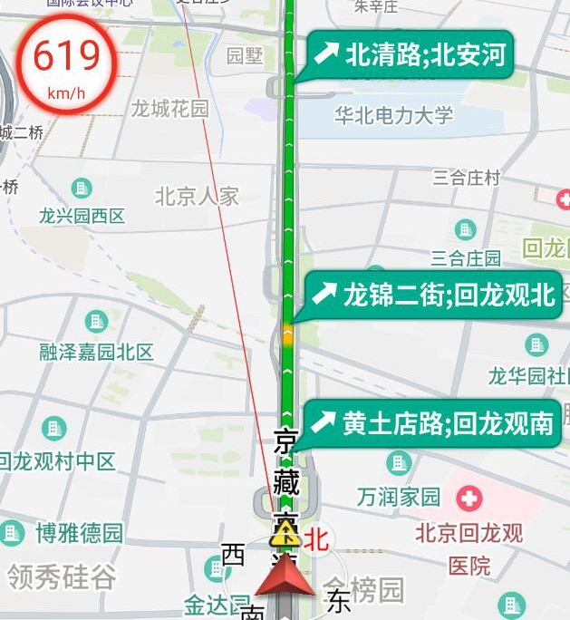

## 2020-07-30 (v.1.19.00)

* 新增行程总结
* 新增轨迹管理和同步

## 2020-07-18 (v1.18.08)

* 新增转弯后的车道提示，如“左转，左转后进入xx车道”
* 新增用户信息（历史关键字、历史POI、历史目的地、车辆信息）在线同步
* 新增高速路上显示出口，连接线，收费站和服务区气泡

* 搜索结果显示地铁线路、公交线路信息

* 导航中横屏模式下显示当前行政区
* 区域内搜索无结果时支持扩大区域搜索
* 修复bug:
    * 修复路线收费金额偶尔不显示的问题

## 2020-07-02

* 新增收藏夹同步功能
* 主界面改版，操作更方便
* 首页新增上报入口
* 新增软件使用问题上报功能
* 高速路牌支持显示出口信息
* 优化地图绘制性能

## 2020-06-18

* 地图支持球面显示
* 路线支持微信分享
* 优化地图上红绿灯显示位置
* 修复bug:
    * 横竖屏切换的车道线显示的问题

## 2020-06-12

* 路口放大图优化
* 增加到了禁行标志
* 优化视口大小
* 优化道路宽度
* 支持港澳右舵行驶道路

## 2020-06-05

* 算路结果页面路线终点显示预计到达时间
* 搜索建议支持按城市分组
* 修改bug
    * 修复华为 mate 手机上导航栏显示问题

## 2020-05-30

* 优化横屏效果，包括路线规划、搜索等（需打开车机模式）
* 优化导航音量，支持更大声音（需打开车机模式）
* 导航时一直显示速度牌

## 2020-05-08

* 新增修改头像、昵称等用户信息功能
* 修改bug
    * 修改个别车机上登陆崩溃的问题

## 2020-04-24

* 新增地点反馈支持搜索
* 放大图添加车信、增强绿地、改进道路平滑
* 新增手机号+密码登录方式
* 新增锁车后显示位置信息
* 路线转向箭头更平滑

## 2020-04-10

* 新增手机号码登录
* 放大图改进鸟瞰视角
* 美化导航转向箭头
* 新增自动巡航功能
* 漫游模式显示车道
* 修改bug
    * 修复路线预览界面横竖屏切换时的崩溃

## 2020-03-26

* 新增道路报错
* 增强路口放大图
    * 合并对向道路
    * 新增路牙子和绿地装饰
    * 优化视口（如右转专用道）
* 美化地图字体：增强描边，加粗
* 使用扁平化 UI 风格
* 新增扫码登录方式
* 修改bug
    * 修复搜索页点击关键字历史崩溃的问题
    * 修改部分车机上导航界面压盖的问题

## 2020-03-13

* 新增问题反馈 (新增POI、新增道路,POI报错) 功能
* 放大图新增黑夜模式配色
* 支持城市+限行搜索
* 导航新增2D车头朝上模式
* 面状区域 (学校、小区等) 选中态轮廓线更美观，缩放保持粗细恒定
* 使用算选分离方案，提升算路质量
* 搜索结果页面，地图上永远显示POI名称
* 主地图支持黑夜模式 (车机模式)
* 新增导航播报音量调节功能 (车机模式)
* 修复bug:
    * 修复算路偏好不立即生效的问题

## 2020-02-27

* 使用新手势，感受丝般顺滑
* 使用新动画，使客户端体验更流畅
* 修复 RouteOverlay 偶尔不能点击的问题
* 修复定位后，终点是“我的位置”时路线起点错误
* 修复打开车机模式后，漫游模式界面在手机上会花屏的问题
* 优化个人中心界面
* 优化曲面屏上搜索框图标压盖和点击不灵敏的问题

## 2020-01-19

* 增强搜索功能(全国搜、地址搜、楼牌号)
* 引导语音增加长实线提醒
* 优化个人中心页面
* 修改放大图压盖沿路信息气泡的问题

## 2019-12-30

* 新增微信登录
* 新增个人中心
* 优化路线宽度，路线更美观

## 2019-12-20

* 修复bugs:
   * 修复偏航不重算问题
   * 修复漫游模式不播报问题

## 2019-12-13

* 新增语音广场
* 优化地铁、道路等编号显示
* 适配车机上的地图显示
* 导航设置中添加智能缩放开关
* 主校区和分校区能区别显示
* 修复bug:
   * 修改非刘海横屏适配的问题
   * 修改桥上桥下图片显示错误

## 2019-11-29

* 新增离线数据商店
* 更换新的APP图标
* 新增点击精模后高亮功能
* 导航横屏模式下，自定义状态栏移到引导面板
* 修复bug：
    * 修复低版本 Android 4.x 上崩溃的问题
    * 修复出隧道定位后显示GPS信号弱的问题
    * 修复记录日志开关的问题
    * 修复语音助手唤醒后播报引导内容的问题

## 2019-11-15

* 优化放大图中环岛的显示
* 唤醒词修改为“你好小新”
* 算路页面，优化路名显示效果
* 关于页面新增QQ群号，更方便联系我们

## 2019-11-05

* 修复bug：
    * 放大图环岛崩溃

## 2019-11-01

* 新增语音助手帮助界面
* 突出显示路线上的主要路名
* 优化环岛、相近路口放大图显示
* 语音助手支持更多指令
    * 查询服务：离服务区还有多远，收费站还有多远，还有多久到
    * 切换功能：我在桥上/桥下，切换到主路/辅路
    * 沿路搜：途径的加油站，顺路去充电等
    * 道路限速：当前道路限速多少
    * 路线偏好设置：高速优先/躲避拥堵
* 适配车机的导航界面
* 修复bug：
    * 启动偶尔崩溃的问题
    * 修复限行查询页点击崩溃的问题
    * 修改导航时黑夜模式不自动切换的问题
    * 修改高速路牌和高速详情字体过小的问题

## 2019-10-17

* 新增语音助手，功能包括：
    * 唤醒词: “你好小新”，“小新你好”
    * 搜索: “东直门”, “附近的加油站”，“清华大学附近的美食”
    * 路线规划: “去东直门”，“导航到四维图新”
    * 其他: “回家”，“去公司”
* 优化雷达路线气泡显示，用不同颜色区分推荐和非推荐路线

## 2019-09-30

* 新增车辆管理功能
* 新增沿路限行浏览功能
* 搜索新增商圈POI类型显示
* 适配 Android 4.2 手机
* 修复bugs:
    * 导航结束返回主界面时路线没有清除

## 2019-09-12

* 新增高速路牌全览

## 2019-08-30

* 路线标签新增红绿灯个数显示

## 2019-08-15

* 路线预览页面新增终点（火车站、机场）的出入口、停车场选择功能
* 导航页面优化：预计到达时间，剩余时间和剩余距离同时显示
* 新增自动清理日志功能
* 步行导航支持设置
* 修复bugs:
    * 漫游模式下屏幕保持常亮

## 2019-08-02

* 新增漫游模式
* 直达POI显示对应的功能面或道路形状点
* 优化历史ETA的显示效果
* 修复bugs：
    * 频繁逆地理崩溃的问题

## 2019-07-18

* 新增历史ETA

## 2019-07-12

* 新增区间测速
* 新增高速出口编号
* 搜索结果优化
* 新增关于页面、服务条款页面
* 新增比例尺黑夜模式

## 2019-06-28

* 上线新一代放大图
* 修复bugs:
    * 横屏导航适配全面屏
    * 地图上POI取消点选时地图中心跳的问题

## 2019-06-20

* 增加记录Poi搜索日志功能
* bugs:
    * 修复打开app偶尔卡死的问题
    * 修复横屏导航车标倾斜的问题
    * 修复点POI查看详情时地图没有动画效果的问题

## 2019-06-13

* 导航支持横屏模式
* 交通事件支持点击
* bugs:
    * 修复点POI查看详情时抖动的问题

## 2019-06-05

* 地图显示过街天桥
* 搜索结果中，行政区显示具体的行政区划类型信息，比如区县等
* 添加高速和快速路上超速时提醒
* 当出现放大图时显示到达时间
* 异常退出时，地图恢复2D正北
* gpsLog按修改时间排序
* bugs:
    * 修复poi搜索结果显示更多有时不能点击的问题
    * 修复poi搜索结果内容初始化位置不正确的问题
    * 修复时间选择器选择的问题
    * 修复导航到达终点崩溃的问题

## 2019-05-23

* 算路新增指定出发时间功能
* 优化导航转向标显示
* 新增导航途经点功能
* 新增屏幕内搜索功能
* 改进路名标注，做到等间距

## 2019-05-09

* 周边搜，支持输入关键字
* 增加途径点删除功能，沿路搜只能存在一个途径点
* 优化导航播报，能正常播报多音字，例如京藏高速
* 沿路搜结果显示多花的时间
* bugs:
    * 修复第一次进入应用时，地图视角为3D的问题

## 2019-04-19

* 支持同音错别字，比如 '安和家园' 
* 支持地名关键字搜索，比如 '回龙观一手店' 
* 搜索建议结果中高亮显示关键字 
* bugs: 
    * 修复搜索建议结果中公交、地铁类型图标不显示的问题
    * 修复路况更新时，路线预览界面时间不更新的问题

## 2019-04-03

* 解决从应用安装器打开应用，应用退到后台，点击桌面图标返回产生的问题 
* 解决应用被系统杀死后自动恢复时出现的问题 

## 2019-03-28

* 绘图日更新数据上线 
* 沿路搜结果中显示绕路时间 
* 优化内存占用 

## 2019-03-22

* 减少交通事件的网络流量，优化绘图效果 
* 应用处于后台，系统内存比较低时，释放缓存资源 

## 2019-03-14

* 导航界面自定义状态栏适配刘海屏 
* 修复路线详情中起终点名称太长显示不全问题 
* 修复路线规划搜索界面最下面白条问题 
* 语音播报的一些改进 
   * 区分“通过前方路口”和“保持直行” 
   * “第二个红绿灯右转”之后播报的“通过红绿灯路口”，具体化为“通过第一个红绿灯” 
   * 连续转弯，播报“即将在红绿灯路口右转” 

## 2019-03-11

* 更换设备屏幕适配方案，适配更精确 
* 导航设置界面，增加拖拽功能 
* 修复到家/公司的路况显示偶尔有问题的bug 
* 复重新算路时，起终点中如果包含“我的位置”，位置不刷新bug 
* 修复在未定位时，显示我的位置图标的bug 
* 地图选点界面，显示已选起点/终点的图标 
* 子poi文字显示用中间省略号 
* 修改进行搜索返回主界面定位图标显示位置不正确的问题 
* 修复搜索模块关键字建议有时不显示的bug 

## 2019-03-01

* poi搜索结果界面增加显示图层设置等按钮 
* 雷达路线标注支持点击 
* 修复大地图与小地图上路线不一致问题 
* 天气图标由黑白色变为彩色 
* 修复从导航界面返回到路线预览界面雷达路线标注显示问题 
* 修复搜索页面点击加载更多偶尔不能点击的问题 
* 去除申请电话权限 

## 2019-02-21

* 修复重算路后，当前路线不高亮问题 
* 删除重算路提示，增加偏离路线提示 
* 路径规划历史记录显示增加判重 
* 修复启动应用时偶发崩溃问题 
* 更改搜索逻辑：定位情况下，若当前地图zoomLevel > 6，且地图中心和定位点不是同一个城市，使用地图中心点；否则，使用自车位置。
* 地图缩放按钮增加阴影背景 

## 2019-02-01

* 导航状态中，增加手动刷新雷达路线 
* 增加主界面我的位置锁车模式 
* 小地图上显示雷达导航路线 
* 增加logo和比例尺切换 
* 增加天气和尾号限行信息的显示 

## 2019-01-24

* 增加路线雷达标注 
* 增加导航界面自定义状态栏 
* 模拟导航时，非锁车模式下增加速度调节按钮 
* 更换路线起终点图标样式 
* Bugs: 
    * 修复算路偏好设置错误的bug

## 2019-01-17

* 新增道路搜索，试试搜“五环” 
* 政策限行浏览中，区分本地客车、外地客车、本地货车和外地货车 
* 算路界面中搜索支持建议 
* 去掉算路方式中的公交 
* 路线规划界面终点文字颜色和起点一致 

## 2019-01-10

* 增加收藏夹功能 
* 增加周边搜功能 
* 增加城市限行查询 
* 增加指南针，比例尺 
* Bugs: 
* 搜索建议界面，历史搜索词和POI预览结果总数最多3条 
* 历史POI最多显示20条 
* 历史关键字最多显示10条 
* 搜索结果中行政区显示具体类型（如直辖市，区县等） 
* 查看行政区搜索结果，点返回必崩 
* 地图一直刷新的问题 
* 算路时使用了显示点，应该都用导航点 

## 2018-12-29

* 增加步行导航 
* 算路结果预览界面支持修改起终点 
* 修改算路主界面布局压盖问题 

## 2018-12-21

* 增加搜索直达poi显示 
* 增加周边搜 
* 突出显示施工中的道路
* 用不同的颜色区面状物标记
* 增加省电模式，自动调节亮度
* 在地图上显示家/公司的图标
* 修改一些bug

## 2018-12-07

* 增加路线详情页
* 优化播报声音，减轻播报机器味

## 2018-11-30

* 新一代路况上线 
* 显示楼栋号 
* 添加更多特色图标 
* 增加App全量更新功能 
* 增加动态获取权限 
* 设置界面支持左右拖拽 
* poi搜索建议内容增加历史搜索词 

## 2018-11-23

* 优化搜索：新增搜索建议列表
* 启用基于红绿灯的播报，比如：500米后第二个红绿灯左转下一个红绿灯左转
* 增加高速路牌引导 

## 2018-11-16

* 新增导航探路模式 
* 地图显示POI，子POI图标区分停车场和出入口
* 匝道显示颜色调整为与 所连接的低等级道路的颜色相同
* 全面优化引导语音和播报时机 
* 增加沿路搜功能 
* 增加导航起终点引导线 
* 算路时避让因为交通事件阻断的道路
* 导航设置新增简洁播报 
* 添加特色图标，比如天安门，天坛公园
* 匝道显示颜色调整为与所连接的低等级道路的颜色相同

## 2018-11-02

* 增加导航界面路况条 
* 选择学校、小区等面状POI,高亮轮廓线
* 支持显示和播报可变车道、潮汐车道
* 突出显示沿路交通事件 
* 启用引擎部研发的搜索服务器 

## 2018-10-19

* 优化poi搜索图层显示 
* 增加热力图 
* 新增内部道路播报 

## 2018-10-12

* 增加poi搜索结果显示图层 
* 增加查看poi详情时poi图标高亮 
* 新增交通事件播报 
* 支持手动切换桥上桥下 

## 2018-09-30

* 完善小地图样式，更美观 
* 动态调整小地图显示范围 
* 路线优化，更平滑，也更美观 
* 自车运动更平顺，并且有提前量 
* 导航设置界面 
* 支持导航过程中，修改路线设置 
* 支持静音 

## 2018-09-21

* 增加拥堵泡泡提示框 
* 路线预览界面支持算路偏好设置
* 修改了一些bug 

## 2018-09-14 

* 新增沿途红绿灯显示 
* 地铁线标注显示优化 
* 路线预览取消渐变色 
* 增加背景阴影效果 
* 修改路线设置主页的一些bug 

## 2018-09-07 

* 显示沿途电子眼和交通标志 
* 细分POI，新增四十多种图标 
* 高层显示绿地水并且支持淡入淡出 
* 路况播报改进：增加畅通播报 
* 路线预览界面可显示收费金额（感谢核心地图部）
* 算路偏好支持多选 
* 回家/到公司增加路线详情显示 

## 2018-08-31 

* 新增拥堵播报 
* 偏航灵敏性进一步提升 
* 增加路线规划首页
* 路线规划首页起终点支持搜索选点,地图选点
* 路线规划首页支持算路偏好设置 
* 支持家/公司地址的设置 
* 增加显示路线规划历史 

## 2018-08-24 

* 路线预览模式、导航模式专用配色 
* 优化高层绿地水系显示效果并且支持淡入淡出
* 优化绿地显示层级，在9级以下显示绿地
* 语音播报优化，新增播报“请保持左侧主路行驶”
* 改进了在线偏航不够灵敏问题 
* 增加昼夜模式切换 
* 优化车道线的显示 
* 增加主辅路切换功能 
* 增加卫星图源设置 
* 修改bug 
    * 无路线模式，关闭电子眼播报
    * 修复离开高速转向箭头不显示 问题
    * 修复打开/关闭路况时，配色不对的问题

## 2018-08-17 

* 路况支持四色 
* 地图打点和点选poi支持设置起点 
* 修改bug 
* 修复启动时概率性崩溃的问题 
* 修复了导航过程中锁车时恢复real3d显示时的bug

## 2018-08-10 

* 新增重要立交桥 3D 导航(MJO) 
* 路线预览界面增加红绿灯数量 
* 改善面状物的绘制级别，能更早的看到大型面状物，比如大学、大型广场
* 在线算路增加“智能推荐”模式。拥堵情况下能优先推荐耗时较小的路线
* 新增高速总结语音：“您将在高速上行驶300公里，途径8个服务区”
* 修复Bug:
    * 导航过程中，位置不移动导致的到达时间不更新

## 2018-08-03 

* 地图渲染升级 
* POI标注增加淡入淡出动画 
* POI文字颜色优化，每种POI都有不同的颜色
* 道路、地铁渲染方式改进，缩放没有粗细跳跃
* 路况图层升级，效果更美观